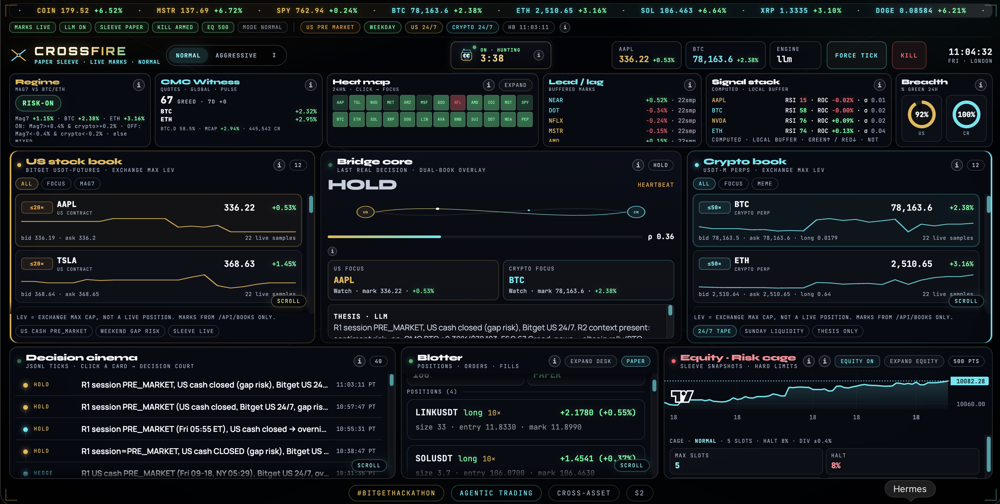

# Crossfire

**Bitget AI Base Camp Hackathon S2** · Agentic Trading · **Cross-Asset Execution Agent**

When US cash equities sleep, Bitget **US stock USDT-M contracts** and **crypto perps** still move. Crossfire reads both books, runs a **5-minute agent heartbeat** (plus event wakes on large mark moves), decides under a hard **Risk Cage**, and logs every tick to append-only JSONL.

Repo: [github.com/CryptoCT01/Crossfire](https://github.com/CryptoCT01/Crossfire)

## Track 2 checklist · Agentic Trading

Ordered for what judges ask for — only what Crossfire actually ships:

- [x] **Runnable demo** — local dashboard on `:8780`, Dual Book + agent deck live
- [x] **LLM as decision-maker** — DeepSeek via OpenRouter on the heartbeat (policy fallback if no key)
- [x] **Event → decision → execution flow** — marks/context → rules + LLM → Risk Cage → paper sleeve fill/log
- [x] **Cross-asset execution** — Mag7 US stock contracts ↔ crypto perps on one Dual Book
- [x] **Risk control layer** — Risk Cage slots / leverage / DD halt (code-enforced)
- [x] **Decision explainability** — Decision Cinema + `/api/explain/:tickId` + Research Bay
- [x] **Paper trading (not live min-size)** — paper sleeve, live Bitget marks, live orders blocked
- [x] **Paper trading log** — append-only JSONL + [docs/PAPER-RUN-RECORDS.md](docs/PAPER-RUN-RECORDS.md) · [docs/paper-trading-fills.jsonl](docs/paper-trading-fills.jsonl)
- [x] **Compliant X post** — quote-tweet demo [timeline](docs/X-POSTS.md) · latest https://x.com/CryptoCT01/status/2101148081504817326
- [x] **Paper scorecard in UI** — Sharpe / max DD / win rate / fills inside Expanded Equity (from real logs)

**Paper record:** competition log is **actively building** (started mid-window; aging continues through the deadline). We don’t claim a finished multi-week backfill — judges can read the live JSONL as it grows.

## Dashboard



*Paper sleeve · live Bitget marks · agent hunting · Decision Cinema / Blotter / Equity Cage.*

## Run

```bash
cd path/to/Crossfire
python3 server.py
# Dashboard: http://127.0.0.1:8780/
# Skip splash: http://127.0.0.1:8780/#floor
```

Optional: copy `.env.example` → `.env` (gitignored). Stdlib only — no `pip install` required for public mode.

## Modes (honest)

| State | Meaning |
|-------|---------|
| **PUBLIC MARKS · SLEEVE DISCONNECTED** | Default. Real Bitget public tickers. No positions simulated. Kill switch disabled. |
| **DEMO / LIVE sleeve** | Set `BITGET_API_KEY`, `BITGET_SECRET_KEY`, `BITGET_PASSPHRASE` + `CROSSFIRE_MODE=demo\|live`. Private hooks are stubbed until you enable live signing; UI stays honest. |

Secrets come **only** from environment / `.env`. Never hardcode keys. Never commit `.env` or `logs/`.

## Architecture

| Piece | Role |
|-------|------|
| `server.py` | Threading HTTP server on **8780** — dashboard + JSON APIs + background heartbeat |
| `crossfire/bitget_public.py` | `USDT-FUTURES` tickers (batch) — no API key |
| `crossfire/bitget_private.py` | Sleeve stubs; skipped when keys missing |
| `crossfire/agent_engine.py` | Tick pipeline: books → policy/LLM → Risk Cage → JSONL |
| `crossfire/config.py` | Universe, Risk Cage constants, env |
| `logs/*.jsonl` | `ticks`, `decisions`, `fills`, `equity` (gitignored) |
| `dashboard.html` | Ambassador command deck — **only** displays server state |

### APIs

- `GET /api/health` — process up, heartbeat config, mode
- `GET /api/books` — real marks / 24h / bid / ask (short cache)
- `GET /api/session` — US cash RTH heuristic (America/New_York), weekend, heartbeat timestamps
- `GET /api/agent/state` — last decision, status, connect mode
- `GET /api/agent/cinema` — last N real JSONL ticks
- `GET /api/blotter` — positions/orders/fills **or** empty + DISCONNECTED
- `GET /api/equity` — equity series from real snapshots (empty if sleeve disconnected)
- `GET /api/explain/:tickId` — full explainability payload
- `POST /api/agent/tick` — force out-of-band tick (real pipeline)
- `POST /api/kill` — `{ "confirm": true }` only if sleeve connected; else **409**

### Decision engine

- **No LLM key** → transparent **policy** path, every decision labeled `engine: policy`. Mag7 24h avg vs BTC divergence → `HEDGE` thesis or `HOLD`. Still runs Risk Cage.
- **LLM key present** → call model, label `engine: llm` + model name. On failure, fall back to policy (never invent transcripts).

### Risk Cage (enforced in code)

Paper sleeve (hackathon demo): **`max_slots=5`**, lev caps 20×/50×, daily halt 8%, sleeve/leg notional caps. Live Normal/Aggressive profiles stay tighter (2 / 3 slots) when not in paper. Without a connected sleeve, hedge theses are **logged only** — no fake fills.

### Heartbeat

- Every **300s** (configurable) background tick
- Event wake if any watched mark moves **≥ 1.5%** since last tick marks

## Universe (Bitget `USDT-FUTURES`)

**US:** AAPL TSLA NVDA META AMZN MSFT GOOGL NFLX AMD COIN MSTR SPY  
**Crypto:** BTC ETH SOL XRP DOGE LINK AVAX BNB SUI DOT NEAR PEPE  

## Security

- No secrets in the repository
- Prefer Bitget **Agentic / Demo** credentials for any future live sleeve
- Kill switch requires connected sleeve + explicit confirmation
- Do not commit `.env`, `HANDOVER.md`, `SUBMISSION-DRAFT.md`, or `logs/`

## Hackathon

- Track: Agentic Trading · Sub-theme: Cross-Asset Execution Agent
- Builder: **cryptoT** ([@CryptoCTO1](https://github.com/CryptoCTO1))
- Handbook: https://bitget-ai.gitbook.io/bitgetai_hackathons2

## License

MIT License — Copyright (c) 2026 cryptoT / CryptoCTO1
